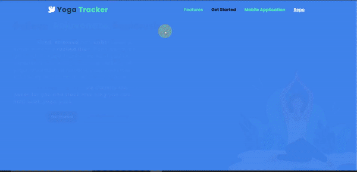
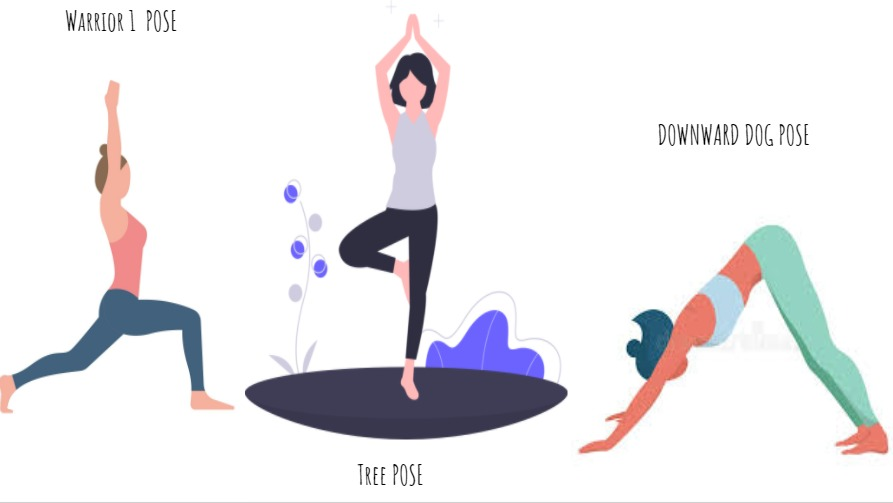

# Yoga Sensei

<b><a href="http://127.0.0.1:5500/Exercise-And-Yoga-Tracker/index.html#mobile-application">Click here</a> to visit website.</b>

### With the need to be fit and healthy on the rise today, Yoga Sensei proves to be a valuable solution. 

* Yoga-Sensei classifies various Yoga poses and not just static pictures but also real time yoga poses performed in front of the camera. 

* It tracks how long you hold a yoga pose and keeps a track record which motivates you in your journey.

* It educates users of various poses and it's benefits along with proper guidance on how to perform them.

## Get Started

<b>It is recommended to open website (index.html) in local machine using live server of vscode or any other Apache server, for fast loading of tensorflowjs model.</b>

## Classification

It can classify yoga poses which are into 2 modes:

* Practice Set
  

* Test Set
  

